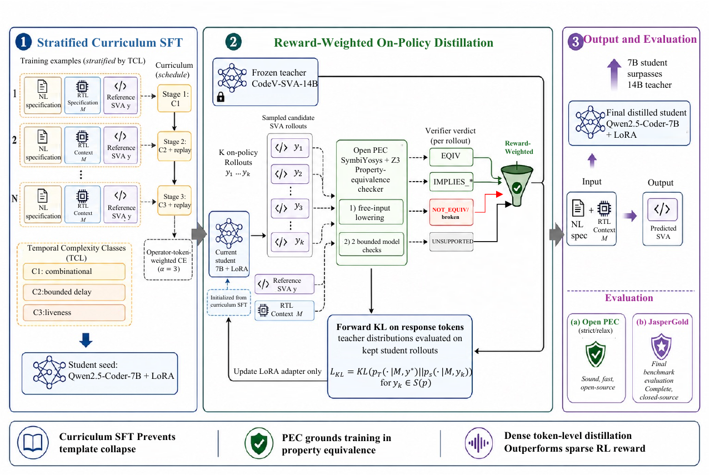

# LLM4SVA

Code accompanying *Reward-Weighted On-Policy Distillation with an Open
Property-Equivalence Verifier for NL-to-SVA Generation*. The paper LaTeX
sources live at the sibling repository `../NeurIPS-LLM4SVA/`; section
numbers below refer to that manuscript.

The repository implements every component of the paper pipeline: the
Temporal Complexity Level (TCL) classifier (§3), the stratified curriculum
SFT seed with temporal-token-weighted cross-entropy (§4.2), the open
SymbiYosys+Z3 Property-Equivalence Checker (§4.3), the OPD / RWOPD
distillation method (§4.1), the GRPO/IPO RLVF baselines (§4.4), the VCS
compile gate and master-pool data pipeline (App. G), and the NL2SVA
evaluation harness (§5).



*Figure 1 from the paper — RWOPD training and evaluation pipeline. A
curriculum-SFT-seeded 7B+LoRA student samples K rollouts; the open
SymbiYosys+Z3 PEC keeps and reward-weights EQUIVALENT or one-sided
implication outputs; the frozen CodeV-SVA-14B teacher then supplies a
dense forward-KL target on the kept tokens, with gradients flowing only
into the LoRA adapter. JasperGold is used for the final pass@k evaluation.
Vector source: [`figs/overview.pdf`](figs/overview.pdf).*

## Repository layout

| Path | Purpose | Paper sections |
| --- | --- | --- |
| `src/` | Reusable library modules — TCL classifier, PEC oracle, temporal-weighted CE, SVA parser, mock verifier, waveform lens. | §3, §4.2, §4.3, App. C–E |
| `training/curriculum_sft/` | Stratified curriculum SFT with temporal-token-weighted cross-entropy (TT-CE). | §4.2, App. D |
| `training/rwopd/` | On-policy distillation from CodeV-SVA-14B (teacher) into Qwen2.5-Coder-7B+LoRA (student). | §4.1, App. B |
| `training/rlvf/` | GRPO and IPO baselines that consume the verifier-equivalence reward. | §4.4, App. F |
| `training/utils/` | LoRA-to-base merge, GRPO visualization. | — |
| `eval/` | NL2SVA-Human / NL2SVA-Machine evaluation drivers, rescorers, watchers. | §5 |
| `data_pipeline/` | Master-pool assembly, NL backfill, normalization rules R1–R17, compile-gate annotation. | App. G |
| `compile_gate/` | VCS / Verilator wrappers plus the `LD_PRELOAD` shim that lets VCS L-2016.06 run on modern glibc. | App. G |
| `pilots/` | Older proof-of-concept pilots kept for reproducibility. | — |
| `tests/` | Unit tests for the reward components, formal oracle, and PEC adapter. | — |
| `tools/` | Misc diagnostics (master-vs-NL2SVA-Human diff, normalize-only). | — |

## Paper → code map

| Paper component | Where it lives |
| --- | --- |
| Template-collapse diagnostic, TCL three-class taxonomy (§3, App. C) | `src/tcl.py`, `src/tcl_classifier.py`, `src/sva_parser.py` |
| Stratified curriculum SFT, TT-CE with α=3, 50% replay (§4.2, App. D) | `training/curriculum_sft/run_curriculum_sft_v2.py`, `src/temporal_loss.py` |
| Reasoning-augmented SFT seed used by OPD (§5 Setup) | `training/curriculum_sft/run_sft_with_reasoning.py` |
| OPD forward-KL on student rollouts, V_min vocab alignment (§4.1, App. B) | `training/rwopd/run_opd_codev_to_qwen.py` |
| RWOPD wrapper (PEC filter + reward weighting, paper Eq. 2–3) | **not yet committed** — see "RWOPD vs OPD gap" below |
| Open PEC oracle, 5-verdict matrix, 4-pass lowering (§4.3, App. E) | `src/pec_yosys.py`, `src/sva_lowering.py`, `src/formal_verify.py`, `src/vacuity.py` |
| Verifier-equivalence reward for RLVF (§4.4, Eq. 4) | `training/rlvf/run_grpo_pilot.py::compute_reward_pec` |
| GRPO / IPO sweep configurations (App. F, Table 4) | `training/rlvf/run_grpo_pilot.py`, `training/rlvf/run_ipo_pilot.py`, `training/rlvf/*.sh` |
| Compile gate, R1–R17 normalization, clock-aware wrapper (App. G) | `data_pipeline/normalize_sva_for_verilator.py`, `compile_gate/vcs_compile_check.py`, `compile_gate/vcs_dynamic_check.py`, `compile_gate/vcs_shim.c` |
| Master-pool assembly (39,914 rows) | `data_pipeline/build_master_train.py`, `data_pipeline/scrape_*.py`, `data_pipeline/backfill_master_rtl.py` |
| NL backfill with GPT-5 (App. G) | `data_pipeline/regenerate_nl_with_gpt5.py`, `data_pipeline/fill_nl_with_*.py` |
| JasperGold and open-PEC rescoring (§5, §5.4 Oracle Agreement) | `eval/run_funcatk_eval.py`, `eval/rescore_funcatk_with_cadence_pec.py`, `eval/rescore_syntax_with_vcs.py`, `eval/summarize_pec_evals.py` |
| Reward differentiation study (50-SVA mutation pool, Fig. 1 left) | `tests/test_combined_reward.py`, `tests/test_formal_mutation.py` |

### TCL classifier (§3, App. C)

`src/tcl_classifier.py` maps an SVA to one of:

- **C1 Combinational** — no temporal operator; sampled-value functions
  (`$rose`, `$fell`, `$stable`) stay C1.
- **C2 Bounded temporal** — `##N`, `##[a:b]`, `[*N]`, `[*a:b]`, `|->`,
  `|=>`, `throughout`, `within`, `intersect`.
- **C3 Liveness** — `s_eventually`, `s_until`, `s_always`, `until_with`.

100% accuracy on a 90-SVA hand-labeled corpus (paper App. C). 32 unit
tests cover comment stripping, label-prefix handling, ranged delays, and
the C1→C2 / C2→C3 promotion rules. Run `python3 -c 'from src.tcl import
_self_test; _self_test()'`.

### Curriculum SFT + TT-CE (§4.2, App. D)

`training/curriculum_sft/run_curriculum_sft_v2.py` drives the 3-stage
curriculum (C1 → C2 → C3). The paper App. D specifies per-stage
hyperparameters:

| Stage | Pool | Epochs | LR | Replay | Val. gate |
| --- | --- | --- | --- | --- | --- |
| 1 | C1-only | 3 | 2e-5 | 0% | C1 acc ≥ 0.85 |
| 2 | C2 + replay | 5 | 1e-5 | 50% | C2 acc ≥ 0.65 |
| 3 | C3 + replay | 6 | 8e-6 | 50% | C3 acc ≥ 0.50 |

The script as committed exposes a single `--epochs-per-stage` and a
single `--lr` applied uniformly across the three stages (defaults: 3
epochs, 2e-5), plus `--replay-ratio` (default 0.5). The paper's per-stage
schedule is reproducible by chaining three invocations with
`--start-stage C2` / `--start-stage C3` and the matching `--lr` /
`--epochs-per-stage`, but the script does not enforce the per-stage
decay or the validation gates automatically.

Temporal-token-weighted CE (`src/temporal_loss.py`) reweights label tokens
whose decoded string contains any of `TEMPORAL_OPS = {##, [*, [=, |->,
|=>, until, eventually, s_eventually, s_until, s_always, throughout,
within, intersect, $rose, $fell}` by α=3; all other tokens stay at weight
1. The membership test runs on per-token decode, so BPE merges that split
`|->` into sub-tokens are still reweighted.

### Open PEC (§4.3, App. E)

`src/pec_yosys.prop_equivalence(ref, lm, rtl)` runs two BMC instances on
the free-input lowering of the RTL and returns one of:

| BMC① | BMC② | Verdict |
| --- | --- | --- |
| PASS | PASS | EQUIVALENT |
| PASS | FAIL | IMPLIES_REF_TO_LM (LM stricter) |
| FAIL | PASS | IMPLIES_LM_TO_REF (LM more permissive) |
| FAIL | FAIL | NOT_EQUIVALENT |
| — | — | UNSUPPORTED (liveness or deep BMC timeout) |
| — | — | PARSE_ERROR |

The four lowering passes in `src/sva_lowering.py` (clock alias injection,
disable-iff extraction, `##N` to delay chain, `$onehot` expansion) make
the C1/C2 fragment of NL2SVA-Human evaluable.

Smoke tests: `python3 src/pec_yosys.py` runs the four canonical pairs
from App. E (self-equivalence, `|->` vs `|=>`, LHS/RHS swap of an
implication, `&&` commutativity).

### OPD / RWOPD (§4.1, App. B)

`training/rwopd/run_opd_codev_to_qwen.py` implements **plain OPD** —
forward-KL from the frozen CodeV-SVA-14B teacher onto the Qwen2.5-Coder-7B
student LoRA on every student rollout. Already matches App. B: V_min
vocab truncation (151,643), response-token-only KL, sampling at T=1.0
top_p=0.95, LoRA-only gradients, AdamW with cosine schedule and 5%
warmup, grad-clip 1.0. Produces the "OPD from CodeV-SVA-14B" row of
Table 1.

**RWOPD vs OPD gap.** The headline "+ RWOPD from CodeV-SVA-14B" row of
Table 1 requires five additional steps that are *not yet committed*:

1. Sample K rollouts per prompt (default K=4, ablated to {1, 2, 4, 8}).
2. Call `src.pec_yosys.prop_equivalence` on each rollout vs. the canonical
   reference in the prompt's RTL context.
3. Map the verdict to a weight via paper Eq. 2:
   `EQUIVALENT → 1.0`, `IMPLIES_REF_TO_LM → 0.6`,
   `IMPLIES_LM_TO_REF → 0.4`, else drop the rollout.
4. If every rollout fails, skip the prompt (Eq. 3 — zero gradient that
   step).
5. Replace the single-rollout loss with the weighted average over the
   surviving rollouts.

The PEC oracle, the verdict enum, and the constants already live in
`src/pec_yosys.py` and `training/rlvf/run_grpo_pilot.py::compute_reward_pec`.
This is the P0 follow-up listed in
`../NeurIPS-LLM4SVA/EXPERIMENT_FOLLOWUP_RUNBOOK.md`.

### RLVF baselines (§4.4, App. F)

`training/rlvf/run_grpo_pilot.py` is the full GRPO driver. The active
reward (`compute_reward_pec` v6 at line 282) is:

```
EQUIVALENT             → 1.0
IMPLIES_REF_TO_LM      → 0.5    (symmetric)
IMPLIES_LM_TO_REF      → 0.5    (symmetric)
otherwise              → 0.0
```

**Note on paper Eq. 4.** The paper writes the reward as 1.0 / 0.6 / 0.4 /
0.15-on-UNSUPPORTED / 0.0. Earlier reward versions (v3/v4) used those
asymmetric IMPLIES weights, but v6 collapses both IMPLIES directions to
0.5 and removes the UNSUPPORTED floor — inline comments at lines 230–250
of `run_grpo_pilot.py` explain that the asymmetric shape caused
IMPLIES-collapse and the floor degraded reward variance after Cadence
canonicalization made UNSUPPORTED rare. The v3/v4 scheme is still
selectable via the older code paths in the same file, but is not the
default. This is the active reward in every GRPO Pilot-2..6 result.

The seven GRPO pilots in App. F Table 4 are driven by the
`run_phase*_chain.sh` / `run_rtl_aware_chain.sh` orchestrators.
`run_ipo_pilot.py` produces the two IPO rows (chosen = PEC-EQUIV,
rejected = PEC-NOT_EQUIV).

### Compile gate and data pipeline (App. G)

`data_pipeline/normalize_sva_for_verilator.py` applies the R1–R17
rewrites (backtick stripping, hierarchical-path flattening, liveness →
`##1`, disable-iff wrapping, action-block removal, parenthesis balancing,
etc.). `compile_gate/vcs_compile_check.py` then synthesizes the
clock-aware free-input wrapper and runs `vcs -sverilog -assert svaext`.
Together they raise VCS pass-rate from 26.5% to 78.6% on the 39,914-row
master pool.

`compile_gate/vcs_shim.c` is the 70-line `LD_PRELOAD` shim documented in
App. G that intercepts `fopen("/proc/<pid>/stat")` so the legacy VCS
L-2016.06 binary stops segfaulting on modern glibc.

### Evaluation (§5)

`eval/run_funcatk_eval.py` is the FVEval-protocol driver — up to 32K
generated tokens, the FVEval system + user prompt template, writes JSON
under `results/`. Post-process with:

- `eval/rescore_funcatk_with_cadence_pec.py` — JasperGold rescoring for
  the headline pass@k in Table 1 (requires a Cadence license).
- `eval/rescore_syntax_with_vcs.py` — VCS rescoring for compile@1.
- `eval/run_eval_with_pec.py` — open-PEC rescoring for the "PEC strict /
  PEC Relax" diagnostic in Fig. 3.
- `eval/summarize_pec_evals.py` — collapse a directory of `*.rescored_*.json`
  files into the row table used in §5.

`eval/_eval_watcher.sh` and `eval/_eval_watcher_qwen3.sh` fire
`eval_all_nl2sva_human.sh` whenever a new checkpoint appears (used during
long GRPO/OPD runs).

## Install

```bash
bash setup.sh
```

`setup.sh` installs the Python dependencies in `requirements.txt`,
attempts to source the OSS CAD Suite (`yosys`, `yosys-slang`, `sby`,
`z3`) used by the open PEC, and verifies the `src/` modules import.

For SymbiYosys-driven PEC checks, the OSS CAD Suite must be on `PATH`.
For JasperGold-based pass@k scoring (the headline Table 1 numbers) a
Cadence JasperGold license is required on the host running
`eval/rescore_funcatk_with_cadence_pec.py`.

## Hardware

All training and evaluation fit on a single H200 (or any 80 GB GPU). The
teacher forward in OPD dominates wall-clock cost; reaching the released
RWOPD checkpoint takes under 20 minutes once the SFT seed is in place
(App. B).

## Reproducing the paper end-to-end

1. **Master training pool** — `data_pipeline/build_master_train.py`
   (scraped GitHub SVAs, OpenTitan macro expansions, FVEval NL2SVA-Machine,
   hand-crafted C3 templates). NL backfill (`regenerate_nl_with_gpt5.py`)
   needs `OPENAI_API_KEY` for the 8,469 unannotated rows.
2. **Normalize and compile-gate** —
   `data_pipeline/normalize_sva_for_verilator.py` (R1–R17), then
   `compile_gate/vcs_compile_check.py`. Raises VCS pass-rate from 26.5%
   to 78.6% on the master pool.
3. **Reasoning-augmented SFT seed** —
   `training/curriculum_sft/run_sft_with_reasoning.py`.
4. **Stratified curriculum SFT with TT-CE** —
   `training/curriculum_sft/run_curriculum_sft_v2.py --replay-fraction 0.5
   --alpha 3.0 --eval-each-stage`.
5. **OPD distillation** — `training/rwopd/run_opd_codev_to_qwen.py`
   (single-rollout OPD; the RWOPD wrapper still needs to be committed,
   see "RWOPD vs OPD gap" above).
6. **(Optional) RLVF baselines** — `training/rlvf/run_grpo_pilot.py`,
   `training/rlvf/run_ipo_pilot.py` plus the `run_phase*_chain.sh`
   orchestrators.
7. **Evaluation** — `eval/run_funcatk_eval.py` to generate NL2SVA
   outputs; `eval/rescore_funcatk_with_cadence_pec.py` for JasperGold
   pass@k; `eval/run_eval_with_pec.py` for the open-PEC diagnostic;
   `eval/summarize_pec_evals.py` to tabulate.

## Data

The paper-referenced datasets — NL2SVA-Human, NL2SVA-Machine, the
39,914-row master training pool, the 81,640-row CodeV-SVA training split,
scraped GitHub corpora, and intermediate JSONL pools — are not bundled
with this repository because of size (~45 GB combined). Released
sources:

- CodeV-SVA training split — from the CodeV-SVA release.
- NL2SVA-Human and NL2SVA-Machine — distributed with FVEval (NVIDIA/FVEval).

## License and citation

Anonymous review release. Citation and license will be added at camera
ready.
